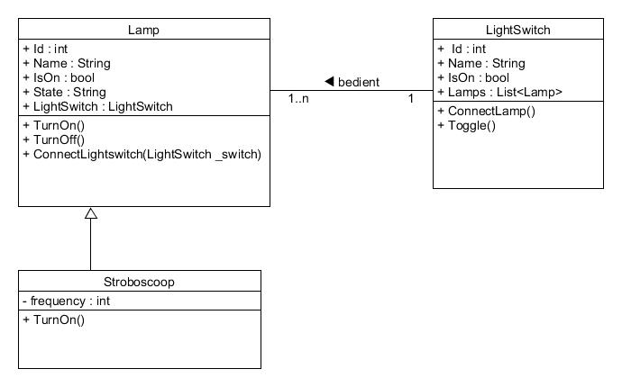

# GloeilampSysteem
Dit project is een voorbeeld van hoe een eenvoudige applicatie eruit zou kunnen zien met 4 lagen zoals die in de inleidende OOP vakken worden uitgelegd.
* Elke laag communiceert alleen met de laag eronder.
* De acties naar de DAL worden met wrappers in het business model aangeroepen.
* We hanteren als method namen **C**reate, **R**ead, **U**pdate en **D**elete zodat deze methods herkenbaar zijn en overeenstemmen met het CRUD verhaal wat wij vertellen

## Class diagram

## Setup
Er zijn diverse data access layers geïmplementeerd in dit voorbeeld. Per data access layer staan hier de stappen om deze aan de praat te krijgen. In de DAL class kan worden aangegeven welke methode gebruikt wordt.

### JsonDAL
* De JsonDAL werkt op basis van een opgeslagen json file. Indien de file niet bestaat wordt deze aangemaakt met dummy data. Er is geen verdere setup vereist. 
* Configureer in de DAL class van de oplossing dat de JsonDal wordt gebruikt.

### SQLDAL
* Maak op SQL server de database en tabellen aan door onderstaande script uit te voeren:
[SQLDAL database script.sql](SQLDAL_database_script.sql)
* Configureer in de DAL class van de oplossing dat de SQLDal wordt gebruikt.

### DapperDAL
* Maak op SQL server de database en tabellen aan door onderstaande script uit te voeren:
[DapperDAL_database_script.sql](DapperDAL_database_script.sql)
* Configureer in de DAL class van de oplossing dat de DapperDal wordt gebruikt.

